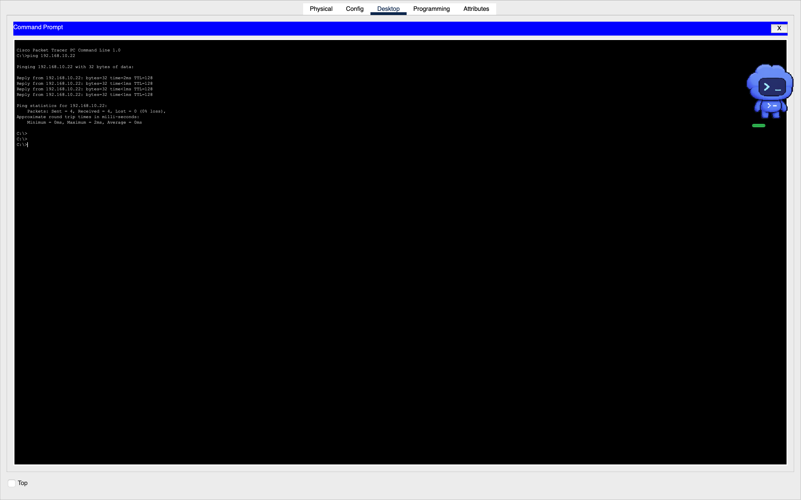

# Packet Tracer verification record

The simulation was built in Cisco Packet Tracer 9.0.1 on macOS and saved as `small-office-vlan-troubleshooting.pkt`. This binary has been copied into the repository without changing the original saved file. The offline configuration validator does not inspect the binary or emulate Cisco IOS.

## Results from the build session

| Check | Result | Evidence |
|---|---|---|
| Router configuration | VLAN 10/20 subinterfaces and DHCP pool commands accepted; Gi0/0 reported up | Router CLI screenshot shared during the session |
| Switch configuration | VLANs 10/20, access-port assignments, and Gi0/1 trunk commands accepted; configuration saved with `[OK]` | Switch CLI screenshot shared during the session |
| PC0 DHCP | Received `192.168.10.21` | Address reported by the user |
| DHCP selection on all PCs | User completed DHCP selection on PC0–PC3 | Remaining addresses not independently recorded |
| PC0 to `192.168.10.22` | Four packets sent, four received, zero loss | PC command-prompt screenshot |
| PC0 to `192.168.10.21` | Four packets sent, four received, zero loss; self-ping | PC command-prompt screenshot; this does not verify routing |
| PC0 to `192.168.20.21` | First attempt: three received, one lost (25% loss); repeated test: zero loss | User-reported packet-loss statistics; screenshot of the repeated test not yet bundled |

## Screenshot evidence

The following original session screenshots are included:

- [Router configuration](evidence/router-configuration.png): accepted gateway and DHCP commands, interface-up messages, and the final router prompt.
- [Switch configuration](evidence/switch-configuration.png): VLAN/access/trunk commands and configuration save confirmation.
- [Same-VLAN ping](evidence/same-vlan-ping.png): four replies from `192.168.10.22`, zero loss.

Cross-VLAN and fault/repair ping screenshots are still outstanding; their statistics below remain user-reported.

## Completed troubleshooting exercise

The user created a separate `vlan20-troubleshooting.pkt` copy so the baseline remained available.

1. On SW1 Gi0/1, changed the allowed trunk VLAN list to `10`.
2. Ran PC0 `ping 192.168.20.21`: user reported **100% packet loss**.
3. Restored the trunk allowed VLAN list to `10,20`.
4. Repeated the same ping: user reported **four received, zero lost**.
5. Saved the repaired troubleshooting copy after being instructed to run `write memory`.

**Root cause:** VLAN 20 was excluded from the switch-to-router trunk. The router could not carry traffic between VLAN 10 and the VLAN 20 endpoint through that link. Restoring VLAN 20 restored connectivity.

The bundled troubleshooting file contains the repaired state, not an intentionally broken network. The failure and repair results are user-reported; screenshots of this exercise and show-command output have not yet been bundled.

## Remaining verification

- Record `ipconfig` for all four PCs, confirming PC0/PC1 use VLAN 10 and PC2/PC3 use VLAN 20.
- Capture a screenshot of the successful repeated cross-VLAN ping, including destination and packet-loss statistics.
- Capture switch `show vlan brief` and `show interfaces trunk`.
- Capture router `show ip interface brief`, `show ip route`, and `show ip dhcp binding`.
- Reopen the saved simulation and confirm it retains the topology and configuration.

## Scope

This is a simulated office LAN. Configuring `1.1.1.1` as the DHCP DNS server does not provide Internet connectivity; the topology contains no Internet uplink or external DNS service. VLANs separate broadcast domains, while the router currently permits communication between the two VLANs. No firewall isolation policy is implemented.
